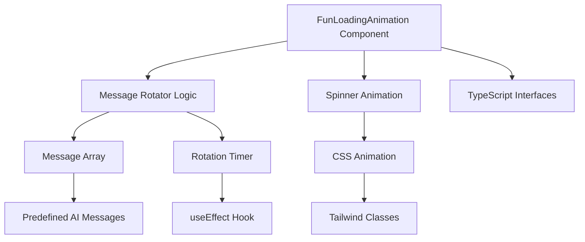

# Design Document: Fun Loading Animation Component

## Overview

The Fun Loading Animation Component is a React component that provides an engaging loading experience for users during AI processing operations. The component combines a rotating collection of humorous AI-themed messages with a simple spinner animation, creating a playful and informative loading state that reduces perceived wait time and maintains user engagement.

The component is designed to be lightweight, performant, and easily reusable throughout the Next.js application. It leverages CSS animations for smooth performance and integrates seamlessly with the existing Tailwind CSS design system.

## Architecture

The component follows a simple, self-contained architecture:



The architecture emphasizes:
- **Separation of Concerns**: Message rotation logic is separate from visual rendering
- **Performance**: CSS-based animations with minimal JavaScript overhead
- **Maintainability**: Clear interfaces and modular structure
- **Reusability**: Self-contained component with configurable props

## Components and Interfaces

### Primary Component: FunLoadingAnimation

**Purpose**: Main component that orchestrates the loading animation experience

**Props Interface**:
```typescript
interface FunLoadingAnimationProps {
  messages?: string[];           // Optional custom messages array
  rotationInterval?: number;     // Optional rotation speed in milliseconds
  size?: 'sm' | 'md' | 'lg';    // Optional size variant
  className?: string;            // Optional additional CSS classes
}
```

**Key Responsibilities**:
- Manage message rotation state and timing
- Render the spinner animation
- Handle component lifecycle (mount/unmount cleanup)
- Apply appropriate styling and layout

### Message Rotation System

**Implementation**: Custom React hook or inline state management

**Core Logic**:
- Maintains current message index state
- Uses `useEffect` with `setInterval` for automatic rotation
- Handles cleanup on component unmount
- Provides smooth transitions between messages

**Default Messages Array**:
```typescript
const DEFAULT_MESSAGES = [
  "AI is thinking 🤖",
  "Cooking magic 🍳", 
  "Almost there 🚀",
  "Crunching numbers 🔢",
  "Brewing insights ☕",
  "Working hard 💪",
  "Making magic happen ✨"
];
```

### Spinner Component

**Implementation**: CSS-based rotating element using Tailwind utilities

**Animation Approach**:
- Uses CSS `@keyframes` or Tailwind's `animate-spin` utility
- Leverages hardware acceleration for smooth performance
- Scalable based on size prop

## Data Models

### Message Model
```typescript
type LoadingMessage = string;
```

### Component State Model
```typescript
interface LoadingState {
  currentMessageIndex: number;
  isActive: boolean;
}
```

### Configuration Model
```typescript
interface LoadingConfig {
  messages: LoadingMessage[];
  rotationInterval: number;
  size: ComponentSize;
}

type ComponentSize = 'sm' | 'md' | 'lg';
```

## Implementation Details

### Message Rotation Logic
The component will use React's `useState` and `useEffect` hooks to manage message rotation:

1. Initialize with message index 0
2. Set up interval timer on component mount
3. Increment index and wrap around when reaching array end
4. Clear interval on component unmount

### Styling Strategy
The component will use Tailwind CSS with the following approach:

- **Layout**: Flexbox for centering and alignment
- **Typography**: Consistent with existing app typography scale
- **Colors**: Neutral colors that work with the existing design
- **Spacing**: Standard Tailwind spacing scale
- **Animations**: Built-in Tailwind animation utilities

### Size Variants
Three size variants will be supported:
- **Small (sm)**: Compact version for inline loading states
- **Medium (md)**: Default size for general use
- **Large (lg)**: Prominent version for full-page loading

### Performance Considerations
- CSS animations instead of JavaScript-based animations
- Efficient re-rendering using React.memo if needed
- Proper cleanup of intervals to prevent memory leaks
- Minimal DOM manipulation

## Correctness Properties

*A property is a characteristic or behavior that should hold true across all valid executions of a system—essentially, a formal statement about what the system should do. Properties serve as the bridge between human-readable specifications and machine-verifiable correctness guarantees.*

### Property 1: Message Display and Content Validation
*For any* rendered FunLoadingAnimation component, the displayed message should always be from the predefined message array and contain appropriate emoji characters
**Validates: Requirements 1.1**

### Property 2: Message Rotation Behavior
*For any* FunLoadingAnimation component that is mounted and active, the message rotation should cycle through all messages in sequence, restart from the beginning after the last message, and maintain consistent timing intervals between rotations
**Validates: Requirements 1.2, 1.3, 1.5**

### Property 3: Spinner Animation Consistency
*For any* rendered FunLoadingAnimation component, the spinner element should have continuous rotation animation applied immediately upon render and maintain smooth animation throughout the component's lifecycle
**Validates: Requirements 2.2, 2.4**

### Property 4: Props Handling and Type Safety
*For any* combination of valid props passed to FunLoadingAnimation, the component should render correctly without errors and handle both presence and absence of optional props appropriately
**Validates: Requirements 3.2, 6.5**

### Property 5: Multiple Instance Performance
*For any* number of simultaneously rendered FunLoadingAnimation components, each instance should maintain independent message rotation and smooth spinner animations without interference
**Validates: Requirements 4.3**

### Property 6: Cleanup on Unmount
*For any* FunLoadingAnimation component that is unmounted, all associated timers and intervals should be properly cleared to prevent memory leaks
**Validates: Requirements 4.5**

### Property 7: Responsive Layout Behavior
*For any* screen size or container width, the FunLoadingAnimation component should maintain proper centering, spacing, and readability across different viewport dimensions
**Validates: Requirements 5.4**

## Error Handling

The component implements defensive programming practices to handle edge cases gracefully:

### Invalid Props Handling
- **Empty Messages Array**: Falls back to default messages if custom messages array is empty
- **Invalid Rotation Interval**: Uses default interval (2000ms) if provided interval is not a positive number
- **Invalid Size Prop**: Defaults to 'md' size if an invalid size is provided

### Runtime Error Prevention
- **Null/Undefined Checks**: All array access operations include bounds checking
- **Timer Cleanup**: Comprehensive cleanup in useEffect return function and component unmount
- **State Validation**: Message index is always validated against array bounds

### Graceful Degradation
- **Animation Fallbacks**: If CSS animations are not supported, component still displays messages
- **Performance Safeguards**: Automatic cleanup prevents runaway timers or memory accumulation

## Testing Strategy

The testing approach combines unit tests for specific behaviors with property-based tests for comprehensive validation:

### Unit Testing Focus
- **Specific Examples**: Test rendering with default props, custom messages, and different size variants
- **Edge Cases**: Test behavior with empty arrays, invalid props, and boundary conditions
- **Integration Points**: Test component mounting, unmounting, and prop updates
- **TypeScript Integration**: Verify type definitions and prop validation

### Property-Based Testing Configuration
- **Testing Library**: React Testing Library with Jest for component testing
- **Minimum Iterations**: 100 test cases per property to ensure comprehensive coverage
- **Test Tagging**: Each property test tagged with format: **Feature: fun-loading-animation, Property {number}: {property_text}**
- **Mock Timers**: Use Jest fake timers to test time-dependent behavior reliably

### Dual Testing Benefits
- **Unit Tests**: Catch specific bugs, validate exact behaviors, test integration scenarios
- **Property Tests**: Verify universal correctness across all input combinations, catch edge cases through randomization
- **Combined Coverage**: Unit tests provide concrete examples while property tests ensure general correctness across the entire input space

### Test Implementation Requirements
- Each correctness property must be implemented as a single property-based test
- Tests must run a minimum of 100 iterations due to randomization
- All time-dependent tests must use mocked timers for reliability
- Component lifecycle tests must verify proper cleanup and state management