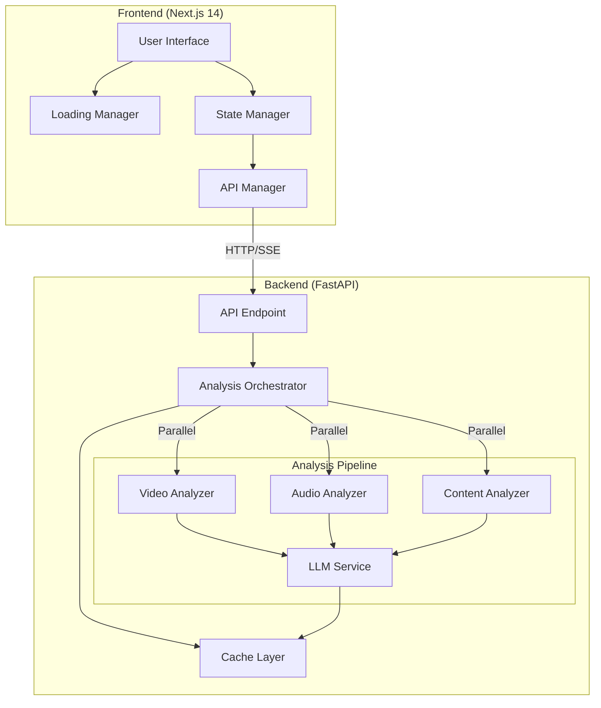
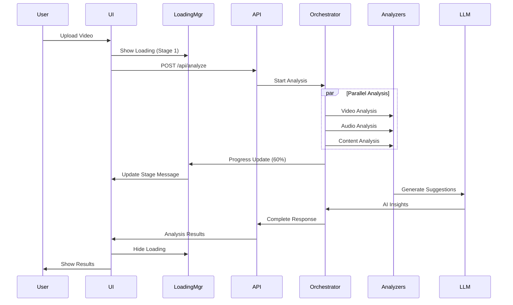
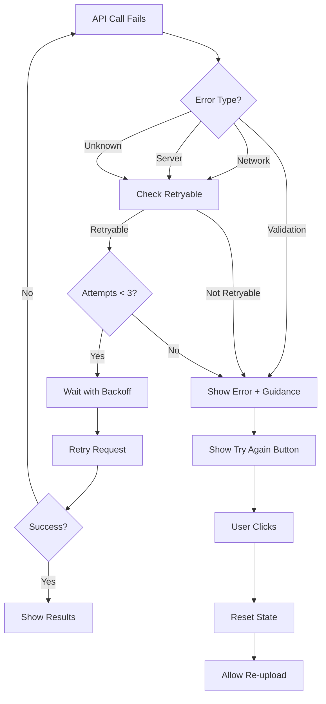

# Design Document: Performance & UX Optimization

## Overview

This design document outlines the technical approach for optimizing the AI Reel Optimizer application's performance and user experience. The optimization focuses on three key areas:

1. **Frontend Performance**: React component optimization, loading animations, and perceived latency reduction
2. **Backend Performance**: Async processing, parallel analysis pipelines, and caching strategies
3. **API Communication**: Efficient data transfer, progress streaming, and error handling

The design leverages Next.js 14 App Router features, React 18 concurrent features, FastAPI's async capabilities, and modern web performance patterns to create a smooth, responsive user experience during video analysis operations.

### Key Design Goals

- Reduce perceived latency by 50% through enhanced loading animations and progress feedback
- Eliminate unnecessary React re-renders using memoization and optimization hooks
- Implement parallel backend processing to reduce actual analysis time by 30-40%
- Provide real-time progress updates during long-running LLM operations
- Maintain 60fps animations and UI responsiveness throughout the analysis workflow

## Architecture

### System Architecture



### Component Interaction Flow



## Components and Interfaces

### Frontend Components

#### 1. Enhanced Loading Manager

**Purpose**: Manage loading states with beautiful animations and progress tracking

**Interface**:
```typescript
interface LoadingManager {
  // State
  isLoading: boolean;
  currentStage: AnalysisStage;
  progress: number; // 0-100
  estimatedTimeRemaining: number; // seconds
  
  // Methods
  startLoading(initialStage: AnalysisStage): void;
  updateProgress(stage: AnalysisStage, progress: number): void;
  completeLoading(): void;
  setError(error: string): void;
}

type AnalysisStage = 
  | 'uploading'
  | 'analyzing_video'
  | 'analyzing_audio'
  | 'transcribing'
  | 'generating_insights'
  | 'finalizing';

interface LoadingAnimationProps {
  stage: AnalysisStage;
  progress: number;
  message: string;
}
```

**Implementation Details**:
- Use CSS animations and transforms for 60fps performance
- Implement multiple animation layers (spinner, gradient orbs, progress bar)
- Stage-specific messages and icons
- Smooth transitions between stages using React Transition Group or Framer Motion
- Non-blocking animations using `requestAnimationFrame`

#### 2. Optimized Upload Section

**Purpose**: Handle file uploads with drag-and-drop, validation, and optimized re-rendering

**Interface**:
```typescript
interface UploadSectionProps {
  onResults: (results: AnalysisResults) => void;
  loading: boolean;
  setLoading: (loading: boolean) => void;
}

interface UploadState {
  file: File | null;
  platform: Platform;
  error: string;
  dragActive: boolean;
}
```

**Optimization Strategies**:
- Memoize callback functions using `useCallback`
- Debounce drag events (100ms) to reduce re-renders
- Use `React.memo` for platform selection buttons
- Extract static content to separate memoized components
- Implement virtual file preview without full re-render

#### 3. Optimized Results Dashboard

**Purpose**: Display analysis results with efficient rendering and smooth animations

**Interface**:
```typescript
interface ResultsDashboardProps {
  results: AnalysisResults;
  onReset: () => void;
}

interface AnalysisResults {
  platform: string;
  overall_score: number;
  video: CategoryScore;
  audio: CategoryScore;
  content: ContentScore;
  top_3_priorities: string[];
  metadata?: {
    processing_time: number;
    timestamp: string;
  };
}

interface CategoryScore {
  score: number;
  issues: string[];
  suggestions: string[];
}

interface ContentScore extends CategoryScore {
  hook_score: number;
  has_cta: boolean;
}
```

**Optimization Strategies**:
- Lazy load using `React.lazy` and `Suspense`
- Memoize score color calculations using `useMemo`
- Use `React.memo` for ScoreCard components
- Implement virtualization for long lists of suggestions
- Code split to reduce initial bundle size

#### 5. Music Recommendation Card

**Purpose**: Display AI-generated background music recommendations for videos without audio

**Interface**:
```typescript
interface MusicRecommendationCardProps {
  recommendation: MusicRecommendation;
}

interface MusicRecommendation {
  genre: string;
  mood: string;
  bpm_range: string;
  vocals_preference: string;
  energy_level: string;
  reasoning: string;
  search_keywords: string[];
}
```

**Implementation Details**:
- Display music characteristics in an organized card layout
- Show reasoning in a collapsible section
- Display search keywords as clickable chips
- Use icons to represent different music characteristics
- Memoize the component using `React.memo`
- Only render when music_recommendation is present in results

**Optimization Strategies**:
- Use `React.memo` to prevent unnecessary re-renders
- Memoize search keyword rendering
- Lazy load icons if using icon library

#### 6. Thumbnail Gallery Component

**Purpose**: Display AI-suggested thumbnail candidates in an interactive gallery

**Interface**:
```typescript
interface ThumbnailGalleryProps {
  thumbnails: ThumbnailSuggestion[];
}

interface ThumbnailSuggestion {
  timestamp: number; // seconds
  score: number; // 0-100
  preview_image: string; // base64 or URL
  reasoning: string;
  is_recommended: boolean; // true for #1 choice
  quality_metrics: {
    sharpness: number;
    brightness: number;
    contrast: number;
    face_detected: boolean;
    composition_score: number;
    color_vibrancy: number;
  };
}
```

**Implementation Details**:
- Display thumbnails in a horizontal carousel or grid layout
- Highlight the #1 recommended thumbnail with a badge or border
- Show timestamp overlay on each thumbnail
- Display score as a visual indicator (progress bar or stars)
- Show reasoning in a tooltip or expandable section
- Provide download button for each thumbnail
- Support keyboard navigation through thumbnails
- Lazy load thumbnail images for performance

**Optimization Strategies**:
- Use `React.memo` to prevent unnecessary re-renders
- Memoize thumbnail rendering with `useMemo`
- Implement virtual scrolling if many thumbnails
- Lazy load images using Intersection Observer
- Compress preview images to reduce payload size

#### 8. Optimization Report Card Component

**Purpose**: Display comprehensive optimization report with model analytics scores, charts, and actionable insights

**Interface**:
```typescript
interface OptimizationReportCardProps {
  report: OptimizationReport;
  onExportPDF: () => void;
  onShare: () => void;
  onCopySummary: () => void;
}

interface OptimizationReport {
  scores: AnalyticsScores;
  performance_metrics: PerformanceMetrics;
  comparative_analytics: ComparativeAnalytics;
  insights: ActionableInsights;
  historical_data?: HistoricalData;
}

interface AnalyticsScores {
  overall_score: number; // 0-100
  category_scores: {
    video_quality: number; // 0-100
    audio_quality: number; // 0-100
    content_effectiveness: number; // 0-100
  };
  engagement_prediction: number; // 0-100
  platform_compatibility: number; // 0-100
  virality_potential: number; // 0-100
}

interface PerformanceMetrics {
  processing_time_breakdown: {
    video_analysis: number; // seconds
    audio_analysis: number;
    content_analysis: number;
    llm_generation: number;
    total: number;
  };
  cache_statistics: {
    hits: number;
    misses: number;
    hit_rate: number; // percentage
  };
  resource_usage: {
    memory_used_mb: number;
    peak_memory_mb: number;
  };
}

interface ComparativeAnalytics {
  platform_benchmarks: {
    [key: string]: number; // score category -> benchmark value
  };
  percentile_rankings: {
    overall: number; // 0-100 (e.g., 75 means "better than 75%")
    video_quality: number;
    audio_quality: number;
    content_effectiveness: number;
    engagement_prediction: number;
  };
  top_performing_aspects: string[]; // Top 3 strengths
  biggest_opportunities: string[]; // Top 3 improvement areas
}

interface ActionableInsights {
  priority_improvements: PriorityImprovement[]; // Top 3 with scores
  quick_wins: Improvement[]; // Easy, high-impact
  advanced_optimizations: Improvement[]; // Harder improvements
}

interface PriorityImprovement {
  title: string;
  description: string;
  current_score: number;
  potential_score: number;
  estimated_impact: number; // 0-100
  difficulty: 'easy' | 'medium' | 'hard';
}

interface Improvement {
  title: string;
  description: string;
  estimated_impact: number; // 0-100
  difficulty: 'easy' | 'medium' | 'hard';
  score_improvement: number; // Expected score increase
}

interface HistoricalData {
  previous_analyses: AnalysisSnapshot[];
  trend_indicators: {
    [key: string]: 'improving' | 'declining' | 'stable';
  };
  implemented_suggestions: string[];
}

interface AnalysisSnapshot {
  timestamp: string;
  overall_score: number;
  category_scores: {
    video_quality: number;
    audio_quality: number;
    content_effectiveness: number;
  };
}
```

**Implementation Details**:
- Display score gauges/progress bars for each metric using a chart library (recharts or chart.js)
- Render radar chart showing multi-dimensional performance across all score categories
- Use color-coded indicators: red (<60), yellow (60-79), green (80+)
- Display comparative analytics with benchmark comparisons
- Show percentile rankings with visual indicators
- Display top performing aspects with green badges
- Display improvement opportunities with yellow/red badges
- Show quick wins and advanced optimizations in separate collapsible sections
- Display estimated impact for each improvement
- Add PDF export button that generates formatted report
- Add share button that generates shareable link
- Add copy summary button that copies text summary to clipboard
- If historical data exists, show trend charts and improvement indicators
- Lazy load chart library for performance

**Optimization Strategies**:
- Use `React.memo` to prevent unnecessary re-renders
- Memoize chart data calculations with `useMemo`
- Lazy load chart library (recharts) using dynamic imports
- Implement collapsible sections to reduce initial render complexity
- Compress PDF generation to reduce file size

#### 7. API Client with Progress Tracking

**Purpose**: Handle API communication with retry logic, timeouts, and progress updates

**Interface**:
```typescript
interface APIClient {
  analyzeVideo(
    file: File,
    platform: Platform,
    onProgress?: (progress: ProgressUpdate) => void
  ): Promise<AnalysisResults>;
  
  cancelRequest(): void;
}

interface ProgressUpdate {
  stage: AnalysisStage;
  progress: number;
  message: string;
  estimatedTimeRemaining?: number;
}

interface APIConfig {
  baseURL: string;
  timeout: number;
  retryAttempts: number;
  retryDelay: number;
}
```

**Implementation Details**:
- Use Axios with interceptors for error handling
- Implement exponential backoff for retries
- Support request cancellation using AbortController
- Optional Server-Sent Events (SSE) for progress streaming
- Compress large payloads using gzip

### Backend Components

#### 1. Analysis Orchestrator

**Purpose**: Coordinate parallel analysis operations and manage workflow

**Interface**:
```python
class AnalysisOrchestrator:
    def __init__(self, video_path: str, platform: str):
        self.video_path = video_path
        self.platform = platform
        self.cache = CacheManager()
    
    async def analyze(
        self,
        progress_callback: Optional[Callable[[ProgressUpdate], None]] = None
    ) -> AnalysisResults:
        """Run all analysis stages in parallel"""
        pass
    
    async def _run_parallel_analysis(self) -> Tuple[VideoMetrics, AudioMetrics, Transcript]:
        """Execute video, audio, and content analysis concurrently"""
        pass
    
    async def _generate_llm_insights(
        self,
        video_metrics: VideoMetrics,
        audio_metrics: AudioMetrics,
        transcript: Transcript
    ) -> LLMSuggestions:
        """Generate AI suggestions with caching"""
        pass
    
    async def _generate_music_recommendation(
        self,
        video_metrics: VideoMetrics,
        audio_metrics: AudioMetrics
    ) -> Optional[MusicRecommendation]:
        """Generate music recommendations for silent/low-audio videos"""
        pass
```

**Implementation Details**:
- Use `asyncio.gather()` for parallel execution
- Implement progress tracking with callbacks
- Handle partial failures gracefully
- Cache intermediate results
- Clean up resources in finally blocks

#### 2. Async Analysis Services

**Purpose**: Convert existing synchronous analyzers to async operations

**Interface**:
```python
class AsyncVideoAnalyzer:
    async def analyze(self) -> VideoMetrics:
        """Analyze video metrics asynchronously"""
        pass
    
    async def _analyze_frames_batch(self, frames: List[np.ndarray]) -> Dict:
        """Process frames in batches to avoid blocking"""
        pass

class AsyncAudioAnalyzer:
    async def analyze(self) -> AudioMetrics:
        """Analyze audio metrics asynchronously"""
        pass
    
    def is_silent_or_low_audio(self, audio_metrics: AudioMetrics) -> bool:
        """Detect if video has no audio or very low audio levels (below -40dB)"""
        pass

class AsyncContentAnalyzer:
    async def transcribe(self) -> Transcript:
        """Transcribe audio asynchronously"""
        pass
```

**Implementation Details**:
- Use `asyncio.to_thread()` for CPU-bound operations
- Process frames/audio in batches with `asyncio.sleep(0)` to yield control
- Implement timeout handling for long operations
- Use thread pools for OpenCV and Librosa operations

#### 4. Thumbnail Suggester

**Purpose**: Extract, analyze, and score video frames for thumbnail recommendations

**Interface**:
```python
class ThumbnailSuggester:
    def __init__(self, video_path: str, platform: str):
        self.video_path = video_path
        self.platform = platform
        self.face_cascade = cv2.CascadeClassifier(cv2.data.haarcascades + 'haarcascade_frontalface_default.xml')
    
    async def generate_suggestions(self, num_suggestions: int = 5) -> List[ThumbnailSuggestion]:
        """Generate top N thumbnail suggestions from video"""
        pass
    
    async def _extract_key_frames(self, interval_seconds: float = 2.0) -> List[Tuple[float, np.ndarray]]:
        """Extract frames at regular intervals throughout video"""
        pass
    
    def _score_frame_quality(self, frame: np.ndarray) -> Dict[str, float]:
        """Score frame based on visual quality metrics"""
        pass
    
    def _detect_faces(self, frame: np.ndarray) -> Tuple[bool, int, float]:
        """Detect faces and return (has_faces, face_count, prominence_score)"""
        pass
    
    def _score_composition(self, frame: np.ndarray) -> float:
        """Score frame composition using rule of thirds"""
        pass
    
    def _score_color_vibrancy(self, frame: np.ndarray) -> float:
        """Score color vibrancy and visual appeal"""
        pass
    
    def _detect_text_overlay(self, frame: np.ndarray) -> Tuple[bool, float]:
        """Detect text/overlays and score visibility"""
        pass
    
    def _calculate_combined_score(
        self,
        quality_metrics: Dict[str, float],
        platform: str
    ) -> float:
        """Calculate combined score with platform-specific weights"""
        pass
    
    async def _generate_preview_image(self, frame: np.ndarray) -> str:
        """Generate thumbnail preview as base64 JPEG"""
        pass
    
    async def _generate_reasoning(
        self,
        frame_data: Dict,
        platform: str
    ) -> str:
        """Use LLM to generate reasoning for thumbnail suggestion"""
        pass

class ThumbnailSuggestion(BaseModel):
    timestamp: float
    score: float
    preview_image: str  # base64 encoded JPEG
    reasoning: str
    is_recommended: bool
    quality_metrics: Dict[str, Any]
```

**Implementation Details**:
- Use OpenCV for frame extraction and analysis
- Extract frames at 2-second intervals (configurable)
- Implement Laplacian variance for sharpness detection
- Use histogram analysis for brightness and contrast
- Use Haar Cascade or DNN for face detection
- Implement rule of thirds grid analysis for composition
- Calculate color saturation and vibrancy using HSV color space
- Use OCR or edge detection for text overlay detection
- Apply platform-specific scoring weights (Instagram prefers faces, YouTube Shorts prefers action)
- Generate 320x180 preview images (16:9 aspect ratio)
- Encode preview images as base64 JPEG with 80% quality
- Use LLM to generate human-readable reasoning for each suggestion
- Sort by combined score and return top N candidates
- Mark highest-scoring candidate as is_recommended=True

#### 7. Report Generator Service

**Purpose**: Calculate model analytics scores and generate comprehensive optimization reports

**Interface**:
```python
class ReportGenerator:
    def __init__(self, platform: str, llm_service: LLMService):
        self.platform = platform
        self.llm_service = llm_service
        self.benchmarks = self._load_platform_benchmarks()
    
    async def generate_report(
        self,
        video_metrics: VideoMetrics,
        audio_metrics: AudioMetrics,
        content_analysis: ContentScore,
        performance_metrics: PerformanceMetrics,
        existing_scores: Dict[str, float]
    ) -> OptimizationReport:
        """Generate comprehensive optimization report with all analytics"""
        pass
    
    def calculate_overall_score(
        self,
        category_scores: Dict[str, float]
    ) -> float:
        """Calculate weighted overall optimization score (0-100)"""
        pass
    
    def calculate_category_scores(
        self,
        video_metrics: VideoMetrics,
        audio_metrics: AudioMetrics,
        content_analysis: ContentScore
    ) -> Dict[str, float]:
        """Calculate category-specific scores (video, audio, content) 0-100"""
        pass
    
    def calculate_engagement_prediction(
        self,
        video_metrics: VideoMetrics,
        audio_metrics: AudioMetrics,
        content_analysis: ContentScore
    ) -> float:
        """Calculate engagement prediction score (0-100) based on multiple factors"""
        pass
    
    def calculate_platform_compatibility(
        self,
        video_metrics: VideoMetrics,
        audio_metrics: AudioMetrics,
        content_analysis: ContentScore
    ) -> float:
        """Calculate platform compatibility score (0-100) based on best practices"""
        pass
    
    def calculate_virality_potential(
        self,
        video_metrics: VideoMetrics,
        content_analysis: ContentScore
    ) -> float:
        """Calculate virality potential score (0-100) based on hook, pacing, content"""
        pass
    
    def calculate_percentile_rankings(
        self,
        scores: AnalyticsScores
    ) -> Dict[str, float]:
        """Calculate percentile rankings by comparing to benchmarks"""
        pass
    
    def identify_top_performing_aspects(
        self,
        scores: AnalyticsScores,
        video_metrics: VideoMetrics,
        audio_metrics: AudioMetrics,
        content_analysis: ContentScore
    ) -> List[str]:
        """Identify top 3 performing aspects of the video"""
        pass
    
    def identify_improvement_opportunities(
        self,
        scores: AnalyticsScores,
        video_metrics: VideoMetrics,
        audio_metrics: AudioMetrics,
        content_analysis: ContentScore
    ) -> List[str]:
        """Identify top 3 biggest improvement opportunities"""
        pass
    
    async def generate_actionable_insights(
        self,
        scores: AnalyticsScores,
        video_metrics: VideoMetrics,
        audio_metrics: AudioMetrics,
        content_analysis: ContentScore,
        top_priorities: List[str]
    ) -> ActionableInsights:
        """Use LLM to generate enhanced insights with impact estimates"""
        pass
    
    def _load_platform_benchmarks(self) -> Dict[str, float]:
        """Load platform-specific benchmark scores"""
        pass

class OptimizationReport(BaseModel):
    scores: AnalyticsScores
    performance_metrics: PerformanceMetrics
    comparative_analytics: ComparativeAnalytics
    insights: ActionableInsights
    historical_data: Optional[HistoricalData] = None

class AnalyticsScores(BaseModel):
    overall_score: float = Field(ge=0, le=100)
    category_scores: Dict[str, float]
    engagement_prediction: float = Field(ge=0, le=100)
    platform_compatibility: float = Field(ge=0, le=100)
    virality_potential: float = Field(ge=0, le=100)

class PerformanceMetrics(BaseModel):
    processing_time_breakdown: Dict[str, float]
    cache_statistics: Dict[str, Any]
    resource_usage: Dict[str, float]

class ComparativeAnalytics(BaseModel):
    platform_benchmarks: Dict[str, float]
    percentile_rankings: Dict[str, float]
    top_performing_aspects: List[str]
    biggest_opportunities: List[str]

class ActionableInsights(BaseModel):
    priority_improvements: List[PriorityImprovement]
    quick_wins: List[Improvement]
    advanced_optimizations: List[Improvement]

class PriorityImprovement(BaseModel):
    title: str
    description: str
    current_score: float
    potential_score: float
    estimated_impact: float = Field(ge=0, le=100)
    difficulty: str

class Improvement(BaseModel):
    title: str
    description: str
    estimated_impact: float = Field(ge=0, le=100)
    difficulty: str
    score_improvement: float
```

**Implementation Details**:
- Calculate overall score as weighted average: video (30%), audio (25%), content (45%)
- Category scores normalize existing 0-10 scores to 0-100 scale
- Engagement prediction uses formula combining hook_score, pacing, audio quality, and CTA presence
- Platform compatibility checks video duration, resolution, aspect ratio, audio levels against platform guidelines
- Virality potential weighs hook_score (40%), scene_changes/pacing (30%), content_effectiveness (30%)
- Percentile rankings compare scores to platform-specific benchmarks (stored as constants or config)
- Top performing aspects identified by scores >= 80
- Improvement opportunities identified by scores < 70
- Use LLM to enhance priority improvements with specific, actionable recommendations
- LLM generates quick wins (easy + high impact) and advanced optimizations (harder improvements)
- Estimate impact scores based on score gaps and improvement potential
- Store platform benchmarks as configuration (can be updated based on data)

#### 5. Cache Manager

**Purpose**: Implement intelligent caching for analysis results and LLM responses

**Interface**:
```python
class CacheManager:
    def __init__(self, max_size_mb: int = 100):
        self.cache: Dict[str, CacheEntry] = {}
        self.max_size_mb = max_size_mb
    
    async def get(self, key: str) -> Optional[Any]:
        """Retrieve cached value"""
        pass
    
    async def set(self, key: str, value: Any, ttl: int = 300):
        """Store value with TTL (seconds)"""
        pass
    
    def generate_key(self, *args) -> str:
        """Generate cache key from arguments"""
        pass
    
    def _evict_lru(self):
        """Evict least recently used entries"""
        pass

class CacheEntry:
    value: Any
    timestamp: float
    ttl: int
    size_bytes: int
    access_count: int
```

**Implementation Details**:
- Use file hash for video cache keys
- Implement LRU eviction policy
- Track cache size and enforce limits
- Store timestamps for TTL expiration
- Serialize using pickle or JSON

#### 6. Progress Streaming (Optional Enhancement)

**Purpose**: Stream real-time progress updates to frontend

**Interface**:
```python
from fastapi.responses import StreamingResponse
from typing import AsyncGenerator

async def stream_analysis_progress(
    video_path: str,
    platform: str
) -> AsyncGenerator[str, None]:
    """Stream progress updates as Server-Sent Events"""
    orchestrator = AnalysisOrchestrator(video_path, platform)
    
    async def progress_callback(update: ProgressUpdate):
        yield f"data: {json.dumps(update)}\n\n"
    
    result = await orchestrator.analyze(progress_callback=progress_callback)
    yield f"data: {json.dumps({'type': 'complete', 'result': result})}\n\n"
```

## Data Models

### Frontend Data Models

```typescript
// Loading State
interface LoadingState {
  isLoading: boolean;
  stage: AnalysisStage;
  progress: number;
  message: string;
  estimatedTime: number;
  startTime: number;
}

// Upload State
interface UploadState {
  file: File | null;
  platform: Platform;
  error: string | null;
  dragActive: boolean;
  uploadProgress: number;
}

// Analysis Results (matches backend response)
interface AnalysisResults {
  platform: string;
  overall_score: number;
  video: CategoryScore;
  audio: CategoryScore;
  content: ContentScore;
  top_3_priorities: string[];
  music_recommendation?: MusicRecommendation;
  thumbnail_suggestions?: ThumbnailSuggestion[];
  metadata: {
    processing_time: number;
    timestamp: string;
    cache_hit: boolean;
  };
}

// Music Recommendation
interface MusicRecommendation {
  genre: string;
  mood: string;
  bpm_range: string;
  vocals_preference: string;
  energy_level: string;
  reasoning: string;
  search_keywords: string[];
}

// Thumbnail Suggestion
interface ThumbnailSuggestion {
  timestamp: number;
  score: number;
  preview_image: string;
  reasoning: string;
  is_recommended: boolean;
  quality_metrics: {
    sharpness: number;
    brightness: number;
    contrast: number;
    face_detected: boolean;
    composition_score: number;
    color_vibrancy: number;
  };
}

// Optimization Report
interface OptimizationReport {
  scores: AnalyticsScores;
  performance_metrics: PerformanceMetrics;
  comparative_analytics: ComparativeAnalytics;
  insights: ActionableInsights;
  historical_data?: HistoricalData;
}

interface AnalyticsScores {
  overall_score: number; // 0-100
  category_scores: {
    video_quality: number;
    audio_quality: number;
    content_effectiveness: number;
  };
  engagement_prediction: number; // 0-100
  platform_compatibility: number; // 0-100
  virality_potential: number; // 0-100
}

interface PerformanceMetrics {
  processing_time_breakdown: {
    video_analysis: number;
    audio_analysis: number;
    content_analysis: number;
    llm_generation: number;
    total: number;
  };
  cache_statistics: {
    hits: number;
    misses: number;
    hit_rate: number;
  };
  resource_usage: {
    memory_used_mb: number;
    peak_memory_mb: number;
  };
}

interface ComparativeAnalytics {
  platform_benchmarks: {
    [key: string]: number;
  };
  percentile_rankings: {
    overall: number;
    video_quality: number;
    audio_quality: number;
    content_effectiveness: number;
    engagement_prediction: number;
  };
  top_performing_aspects: string[];
  biggest_opportunities: string[];
}

interface ActionableInsights {
  priority_improvements: PriorityImprovement[];
  quick_wins: Improvement[];
  advanced_optimizations: Improvement[];
}

interface PriorityImprovement {
  title: string;
  description: string;
  current_score: number;
  potential_score: number;
  estimated_impact: number;
  difficulty: 'easy' | 'medium' | 'hard';
}

interface Improvement {
  title: string;
  description: string;
  estimated_impact: number;
  difficulty: 'easy' | 'medium' | 'hard';
  score_improvement: number;
}

interface HistoricalData {
  previous_analyses: AnalysisSnapshot[];
  trend_indicators: {
    [key: string]: 'improving' | 'declining' | 'stable';
  };
  implemented_suggestions: string[];
}

interface AnalysisSnapshot {
  timestamp: string;
  overall_score: number;
  category_scores: {
    video_quality: number;
    audio_quality: number;
    content_effectiveness: number;
  };
}

// Error State
interface ErrorState {
  message: string;
  code: string;
  retryable: boolean;
  details?: any;
}
```

### Backend Data Models

```python
from pydantic import BaseModel, Field
from typing import List, Optional, Dict, Any
from datetime import datetime

class VideoMetrics(BaseModel):
    duration: float
    resolution: Dict[str, int]
    fps: float
    brightness: Dict[str, Any]
    blur_score: float
    scene_changes: int
    first_frame_quality: Dict[str, Any]

class AudioMetrics(BaseModel):
    duration: float
    sample_rate: int
    loudness: Dict[str, Any]
    silence_gaps: List[Dict[str, float]]
    noise_level: Dict[str, Any]
    has_audio: bool

class Transcript(BaseModel):
    text: str
    segments: List[Dict[str, Any]] = []
    language: Optional[str] = None

class CategoryScore(BaseModel):
    score: float = Field(ge=0, le=10)
    issues: List[str]
    suggestions: List[str]

class ContentScore(CategoryScore):
    hook_score: float = Field(ge=0, le=10)
    has_cta: bool

class AnalysisResults(BaseModel):
    platform: str
    overall_score: float = Field(ge=0, le=10)
    video: CategoryScore
    audio: CategoryScore
    content: ContentScore
    top_3_priorities: List[str]
    music_recommendation: Optional[MusicRecommendation] = None
    thumbnail_suggestions: Optional[List[ThumbnailSuggestion]] = None
    optimization_report: Optional[OptimizationReport] = None
    metadata: Optional[Dict[str, Any]] = None

class MusicRecommendation(BaseModel):
    genre: str
    mood: str
    bpm_range: str
    vocals_preference: str
    energy_level: str
    reasoning: str
    search_keywords: List[str]

class ThumbnailSuggestion(BaseModel):
    timestamp: float
    score: float = Field(ge=0, le=100)
    preview_image: str  # base64 encoded JPEG
    reasoning: str
    is_recommended: bool
    quality_metrics: Dict[str, Any]

class OptimizationReport(BaseModel):
    scores: AnalyticsScores
    performance_metrics: PerformanceMetrics
    comparative_analytics: ComparativeAnalytics
    insights: ActionableInsights
    historical_data: Optional[HistoricalData] = None

class AnalyticsScores(BaseModel):
    overall_score: float = Field(ge=0, le=100)
    category_scores: Dict[str, float]
    engagement_prediction: float = Field(ge=0, le=100)
    platform_compatibility: float = Field(ge=0, le=100)
    virality_potential: float = Field(ge=0, le=100)

class PerformanceMetrics(BaseModel):
    processing_time_breakdown: Dict[str, float]
    cache_statistics: Dict[str, Any]
    resource_usage: Dict[str, float]

class ComparativeAnalytics(BaseModel):
    platform_benchmarks: Dict[str, float]
    percentile_rankings: Dict[str, float]
    top_performing_aspects: List[str]
    biggest_opportunities: List[str]

class ActionableInsights(BaseModel):
    priority_improvements: List[PriorityImprovement]
    quick_wins: List[Improvement]
    advanced_optimizations: List[Improvement]

class PriorityImprovement(BaseModel):
    title: str
    description: str
    current_score: float
    potential_score: float
    estimated_impact: float = Field(ge=0, le=100)
    difficulty: str

class Improvement(BaseModel):
    title: str
    description: str
    estimated_impact: float = Field(ge=0, le=100)
    difficulty: str
    score_improvement: float

class HistoricalData(BaseModel):
    previous_analyses: List[AnalysisSnapshot]
    trend_indicators: Dict[str, str]
    implemented_suggestions: List[str]

class AnalysisSnapshot(BaseModel):
    timestamp: str
    overall_score: float
    category_scores: Dict[str, float]

class ProgressUpdate(BaseModel):
    stage: str
    progress: int = Field(ge=0, le=100)
    message: str
    estimated_time_remaining: Optional[int] = None
```


## Correctness Properties

*A property is a characteristic or behavior that should hold true across all valid executions of a system—essentially, a formal statement about what the system should do. Properties serve as the bridge between human-readable specifications and machine-verifiable correctness guarantees.*

### Frontend Properties

**Property 1: Stage-specific progress indicators**
*For any* analysis stage, when the loading state is updated to that stage, the progress indicator SHALL display the correct stage-specific message and icon.
**Validates: Requirements 1.2, 6.1**

**Property 2: UI responsiveness during async operations**
*For any* async API call in progress, other UI elements (buttons, inputs, navigation) SHALL remain interactive and responsive to user input.
**Validates: Requirements 2.1, 2.4**

**Property 3: Localized state updates**
*For any* state change, only components that depend on the changed state SHALL re-render, not the entire component tree.
**Validates: Requirements 2.5, 3.1**

**Property 4: Callback reference stability**
*For any* memoized callback function, the function reference SHALL remain stable across renders when dependencies haven't changed.
**Validates: Requirements 3.2**

**Property 5: Memoization prevents recalculation**
*For any* expensive computation wrapped in useMemo, the computation SHALL not re-execute when unrelated state changes occur.
**Validates: Requirements 3.3, 10.3**

**Property 6: Prop reference stability**
*For any* object or array passed as props, the reference SHALL remain stable across renders when the content hasn't changed.
**Validates: Requirements 3.4**

**Property 7: Debounced event handlers**
*For any* debounced event handler, rapid successive events SHALL result in only one handler execution after the debounce delay.
**Validates: Requirements 3.5**

**Property 8: Exponential backoff retry**
*For any* transient API error, retry attempts SHALL occur with exponentially increasing delays (e.g., 1s, 2s, 4s, 8s).
**Validates: Requirements 4.3**

**Property 9: Error-specific messaging**
*For any* error type (timeout, network failure, server error), the displayed error message SHALL be specific to that error type with appropriate guidance.
**Validates: Requirements 8.1, 8.5**

**Property 10: Error logging with user-friendly display**
*For any* error that occurs, the full error details SHALL be logged to console while a simplified, user-friendly message is displayed in the UI.
**Validates: Requirements 8.4**

**Property 11: State preservation on platform change**
*For any* form state (file, error messages), when the platform selection changes, all other form fields SHALL retain their current values.
**Validates: Requirements 10.4**

**Property 12: ETA calculation accuracy**
*For any* analysis in progress, the estimated time remaining SHALL be calculated based on current progress and typical processing duration, updating as progress advances.
**Validates: Requirements 6.4**

### Backend Properties

**Property 13: Parallel analysis execution**
*For any* video analysis request, the video_analyzer, audio_analyzer, and content_analyzer SHALL execute concurrently using asyncio.gather() or equivalent parallel execution.
**Validates: Requirements 2.2, 5.1**

**Property 14: Response compression for large payloads**
*For any* API response where the payload size exceeds 1KB, the response SHALL include compression headers (gzip or brotli).
**Validates: Requirements 4.4**

**Property 15: Progress notifications at stage boundaries**
*For any* analysis stage completion, a progress notification SHALL be sent to the client with updated stage and progress percentage.
**Validates: Requirements 4.2, 6.2**

**Property 16: LLM response caching**
*For any* LLM prompt with identical inputs (video metrics, audio metrics, transcript, platform), the second request SHALL return cached results without calling the LLM service.
**Validates: Requirements 5.2, 10.2**

**Property 17: Temporary file cleanup**
*For any* temporary file created during analysis (extracted audio, intermediate frames), the file SHALL be deleted after the analysis completes or fails.
**Validates: Requirements 5.3**

**Property 18: Input validation before processing**
*For any* uploaded video file, validation (file size, duration, format) SHALL occur before starting expensive analysis operations.
**Validates: Requirements 5.5**

**Property 19: Structured error responses**
*For any* backend error, the error response SHALL include a structured format with error code, message, and details fields.
**Validates: Requirements 8.2**

**Property 20: Processing time logging**
*For any* analysis stage (video, audio, content, LLM), the processing duration SHALL be logged with stage identifier and timestamp.
**Validates: Requirements 9.1**

**Property 21: Response metadata inclusion**
*For any* completed analysis, the response SHALL include metadata with processing_time, timestamp, and cache_hit fields.
**Validates: Requirements 9.3**

**Property 22: Memory usage monitoring**
*For any* video processing operation, memory usage SHALL be logged before processing starts and after processing completes.
**Validates: Requirements 9.5**

**Property 23: Video analysis result caching**
*For any* video file, when analyzed multiple times within 5 minutes, the second analysis SHALL return cached results using the file hash as cache key.
**Validates: Requirements 10.1**

**Property 24: LRU cache eviction**
*For any* cache that exceeds 100MB in size, the least recently used entries SHALL be evicted until the cache size is below the threshold.
**Validates: Requirements 10.5**

### Music Recommendation Properties

**Property 25: Silent/low-audio detection**
*For any* audio sample with average volume below -40dB, the audio analyzer SHALL correctly identify it as silent or low-audio.
**Validates: Requirements 11.1**

**Property 26: Music recommendation generation for silent videos**
*For any* video identified as silent or low-audio, the LLM service SHALL generate a music recommendation object containing all required fields.
**Validates: Requirements 11.2**

**Property 27: Music recommendation completeness**
*For any* generated music recommendation, the response SHALL include non-empty values for genre, mood, BPM range, vocals preference, and energy level.
**Validates: Requirements 11.3**

**Property 28: Music recommendation reasoning inclusion**
*For any* generated music recommendation, the response SHALL include a non-empty reasoning field that explains the recommendation.
**Validates: Requirements 11.4**

**Property 29: Search keywords inclusion**
*For any* generated music recommendation, the response SHALL include a non-empty list of search keywords.
**Validates: Requirements 11.5**

**Property 30: Music recommendation card rendering**
*For any* analysis result containing a music recommendation, the ResultsDashboard SHALL render a music recommendation card displaying all recommendation details.
**Validates: Requirements 11.6**

**Property 31: Conditional music recommendation display**
*For any* analysis result without a music recommendation, the ResultsDashboard SHALL not render the music recommendation section.
**Validates: Requirements 11.7**

### Thumbnail Suggestion Properties

**Property 32: Key frame extraction at intervals**
*For any* video, when key frames are extracted, frames SHALL be extracted at regular intervals throughout the video timeline.
**Validates: Requirements 12.1**

**Property 33: Frame quality evaluation completeness**
*For any* extracted frame, the quality evaluation SHALL return scores for sharpness, brightness, and contrast.
**Validates: Requirements 12.2**

**Property 34: Face detection and prominence**
*For any* frame containing faces, the face detection SHALL return face count and prominence scores.
**Validates: Requirements 12.3**

**Property 35: Composition scoring**
*For any* frame, the composition analysis SHALL return a rule-of-thirds score.
**Validates: Requirements 12.5**

**Property 36: Color vibrancy scoring**
*For any* frame, the color vibrancy analysis SHALL return a vibrancy score.
**Validates: Requirements 12.6**

**Property 37: Text detection and visibility**
*For any* frame, the text detection SHALL return whether text is present and a visibility score.
**Validates: Requirements 12.7**

**Property 38: Platform-specific score adjustment**
*For any* set of scored frames, different platforms SHALL produce different score adjustments based on platform-specific best practices.
**Validates: Requirements 12.8**

**Property 39: Top candidates selection and sorting**
*For any* set of scored frames, the returned thumbnail candidates SHALL be sorted by score in descending order and limited to the requested number (3-5).
**Validates: Requirements 12.9**

**Property 40: Preview image generation**
*For any* selected thumbnail frame, a preview image SHALL be generated with dimensions approximately 320x180 and encoded as JPEG.
**Validates: Requirements 12.10**

**Property 41: Thumbnail reasoning inclusion**
*For any* generated thumbnail suggestion, the reasoning field SHALL be non-empty and explain why the thumbnail is effective.
**Validates: Requirements 12.11**

**Property 42: Thumbnail suggestion completeness**
*For any* generated thumbnail suggestion, all required fields (timestamp, score, preview_image, reasoning, is_recommended, quality_metrics) SHALL be present and valid.
**Validates: Requirements 12.12**

**Property 43: Thumbnail gallery rendering**
*For any* analysis result containing thumbnail suggestions, the ResultsDashboard SHALL render a thumbnail gallery component displaying all suggestions.
**Validates: Requirements 12.13**

**Property 44: Recommended thumbnail highlighting**
*For any* set of displayed thumbnails, the thumbnail with is_recommended=true SHALL have visual highlighting (badge, border, or special styling).
**Validates: Requirements 12.14**

**Property 45: Thumbnail metadata display**
*For any* displayed thumbnail, the timestamp SHALL be visible and a download button SHALL be present.
**Validates: Requirements 12.15**

**Property 46: Thumbnail data in response**
*For any* analysis where thumbnails are generated, the thumbnail_suggestions field SHALL be present in the AnalysisResults response.
**Validates: Requirements 12.16**

### Optimization Report Properties

**Property 47: Optimization report generation**
*For any* completed video analysis, an optimization report SHALL be generated with all required analytics scores and metrics.
**Validates: Requirements 13.1**

**Property 48: Overall score calculation**
*For any* set of category scores, the overall optimization score SHALL be calculated as a weighted average and fall within 0-100 range.
**Validates: Requirements 13.2**

**Property 49: Category score calculation**
*For any* video analysis, category-specific scores for video quality, audio quality, and content effectiveness SHALL each be calculated and fall within 0-100 range.
**Validates: Requirements 13.3**

**Property 50: Engagement prediction score**
*For any* video analysis, an engagement prediction score SHALL be calculated based on video metrics and content analysis and fall within 0-100 range.
**Validates: Requirements 13.4**

**Property 51: Platform compatibility score**
*For any* video analysis, a platform compatibility score SHALL be calculated based on platform-specific best practices and fall within 0-100 range.
**Validates: Requirements 13.5**

**Property 52: Virality potential score**
*For any* video analysis, a virality potential score SHALL be calculated based on hook strength, pacing, and content characteristics and fall within 0-100 range.
**Validates: Requirements 13.6**

**Property 53: Processing time breakdown inclusion**
*For any* optimization report, the performance metrics SHALL include processing time breakdown for all analysis stages (video, audio, content, LLM).
**Validates: Requirements 13.7**

**Property 54: Cache statistics inclusion**
*For any* optimization report, the performance metrics SHALL include cache hit/miss statistics.
**Validates: Requirements 13.8**

**Property 55: Resource usage metrics inclusion**
*For any* optimization report, the performance metrics SHALL include resource usage metrics (memory, processing time).
**Validates: Requirements 13.9**

**Property 56: Benchmark comparison**
*For any* optimization report, scores SHALL be compared against platform-specific benchmarks.
**Validates: Requirements 13.10**

**Property 57: Percentile ranking calculation**
*For any* optimization report, percentile rankings SHALL be calculated for each score category.
**Validates: Requirements 13.11**

**Property 58: Top performing aspects identification**
*For any* optimization report, the top 3 performing aspects SHALL be identified and included.
**Validates: Requirements 13.12**

**Property 59: Improvement opportunities identification**
*For any* optimization report, the 3 biggest improvement opportunities SHALL be identified based on score gaps.
**Validates: Requirements 13.13**

**Property 60: Priority improvements enhancement**
*For any* optimization report, the top 3 priority improvements SHALL be enhanced with specific score-based recommendations from the LLM.
**Validates: Requirements 13.14**

**Property 61: Quick wins identification**
*For any* optimization report, quick wins (easy improvements with high impact) SHALL be identified with estimated score improvements.
**Validates: Requirements 13.15**

**Property 62: Advanced optimizations identification**
*For any* optimization report, advanced optimizations (harder improvements) SHALL be identified with estimated score improvements.
**Validates: Requirements 13.16**

**Property 63: Impact score estimation**
*For any* suggested improvement in the optimization report, an estimated impact score (0-100) SHALL be included.
**Validates: Requirements 13.17**

**Property 64: Score gauge rendering**
*For any* optimization report displayed in the ResultsDashboard, score gauges or progress bars SHALL be rendered for each metric.
**Validates: Requirements 13.18**

**Property 65: Radar chart rendering**
*For any* optimization report displayed in the ResultsDashboard, a radar chart SHALL be rendered showing multi-dimensional performance across all score categories.
**Validates: Requirements 13.19**

**Property 66: Color-coded indicators**
*For any* score displayed in the optimization report, color-coded indicators SHALL be used based on score thresholds (red <60, yellow 60-79, green 80+).
**Validates: Requirements 13.20**

**Property 67: Comparative analytics display**
*For any* optimization report displayed in the ResultsDashboard, comparative analytics (benchmarks and percentile rankings) SHALL be displayed.
**Validates: Requirements 13.21**

**Property 68: Performance and opportunities display**
*For any* optimization report displayed in the ResultsDashboard, top performing aspects and improvement opportunities SHALL be displayed in separate sections.
**Validates: Requirements 13.22**

**Property 69: Quick wins and advanced optimizations display**
*For any* optimization report displayed in the ResultsDashboard, quick wins and advanced optimizations SHALL be displayed with estimated impact.
**Validates: Requirements 13.23**

**Property 70: PDF export functionality**
*For any* optimization report displayed, a download button SHALL be provided to export the report as PDF.
**Validates: Requirements 13.24**

**Property 71: PDF generation**
*For any* PDF export request, a formatted PDF report SHALL be generated with all scores, charts, and recommendations.
**Validates: Requirements 13.25**

**Property 72: Share functionality**
*For any* optimization report displayed, a share button SHALL be provided to generate a shareable report link.
**Validates: Requirements 13.26**

**Property 73: Copy summary functionality**
*For any* optimization report displayed, a copy button SHALL be provided to copy the report summary to clipboard.
**Validates: Requirements 13.27**

**Property 74: Historical data storage**
*For any* video re-analysis with historical tracking enabled, the analysis history SHALL be stored with timestamps.
**Validates: Requirements 13.28**

**Property 75: Improvement over time display**
*For any* optimization report with historical tracking enabled, improvement over time SHALL be shown with trend indicators.
**Validates: Requirements 13.29**

**Property 76: Implemented suggestions tracking**
*For any* optimization report with historical tracking enabled, which suggestions were implemented SHALL be shown based on score improvements.
**Validates: Requirements 13.30**

## Error Handling

### Frontend Error Handling

**Error Categories**:
1. **Network Errors**: Connection failures, timeouts, DNS issues
2. **Validation Errors**: Invalid file type, size, duration
3. **Server Errors**: 500 errors, processing failures
4. **Client Errors**: 400 errors, invalid requests

**Error Handling Strategy**:

```typescript
interface ErrorHandler {
  handleError(error: Error | AxiosError): ErrorState;
  shouldRetry(error: Error): boolean;
  getRetryDelay(attemptNumber: number): number;
  getUserMessage(error: Error): string;
}

class APIErrorHandler implements ErrorHandler {
  handleError(error: Error | AxiosError): ErrorState {
    if (axios.isAxiosError(error)) {
      if (error.code === 'ECONNABORTED') {
        return {
          message: 'Analysis is taking longer than expected. Please try with a shorter video.',
          code: 'TIMEOUT',
          retryable: true
        };
      }
      
      if (error.response?.status === 500) {
        return {
          message: 'Server error occurred. Our team has been notified.',
          code: 'SERVER_ERROR',
          retryable: true
        };
      }
      
      if (error.response?.status === 413) {
        return {
          message: 'Video file is too large. Please upload a file under 100MB.',
          code: 'FILE_TOO_LARGE',
          retryable: false
        };
      }
    }
    
    return {
      message: 'An unexpected error occurred. Please try again.',
      code: 'UNKNOWN',
      retryable: true
    };
  }
  
  shouldRetry(error: Error): boolean {
    const errorState = this.handleError(error);
    return errorState.retryable;
  }
  
  getRetryDelay(attemptNumber: number): number {
    // Exponential backoff: 1s, 2s, 4s, 8s
    return Math.min(1000 * Math.pow(2, attemptNumber), 8000);
  }
}
```

**Error Recovery Flow**:



### Backend Error Handling

**Error Response Format**:

```python
from fastapi import HTTPException
from fastapi.responses import JSONResponse
from typing import Optional

class APIError(Exception):
    def __init__(
        self,
        message: str,
        code: str,
        status_code: int = 500,
        details: Optional[dict] = None
    ):
        self.message = message
        self.code = code
        self.status_code = status_code
        self.details = details or {}

class ErrorResponse(BaseModel):
    error: str
    code: str
    message: str
    details: Dict[str, Any] = {}
    timestamp: str

@app.exception_handler(APIError)
async def api_error_handler(request: Request, exc: APIError):
    return JSONResponse(
        status_code=exc.status_code,
        content=ErrorResponse(
            error=exc.__class__.__name__,
            code=exc.code,
            message=exc.message,
            details=exc.details,
            timestamp=datetime.utcnow().isoformat()
        ).dict()
    )

# Usage in endpoints
@app.post("/api/analyze")
async def analyze_video(video: UploadFile, platform: str):
    try:
        # Validation
        if video.size > 100 * 1024 * 1024:  # 100MB
            raise APIError(
                message="Video file exceeds maximum size of 100MB",
                code="FILE_TOO_LARGE",
                status_code=413,
                details={"max_size_mb": 100, "actual_size_mb": video.size / 1024 / 1024}
            )
        
        # Processing
        result = await orchestrator.analyze(video_path, platform)
        return result
        
    except asyncio.TimeoutError:
        raise APIError(
            message="Analysis timed out. Please try with a shorter video.",
            code="PROCESSING_TIMEOUT",
            status_code=504
        )
    
    except Exception as e:
        logger.error(f"Unexpected error: {str(e)}", exc_info=True)
        raise APIError(
            message="An unexpected error occurred during analysis",
            code="INTERNAL_ERROR",
            status_code=500,
            details={"error_type": type(e).__name__}
        )
```

**Resource Cleanup**:

```python
import contextlib
from pathlib import Path

@contextlib.asynccontextmanager
async def temporary_file(suffix: str = ""):
    """Context manager for temporary files with guaranteed cleanup"""
    temp_path = None
    try:
        temp_path = Path(tempfile.mktemp(suffix=suffix))
        yield temp_path
    finally:
        if temp_path and temp_path.exists():
            temp_path.unlink()
            logger.debug(f"Cleaned up temporary file: {temp_path}")

# Usage
async def analyze_video(video_path: str):
    async with temporary_file(suffix=".wav") as audio_path:
        # Extract audio
        extract_audio(video_path, audio_path)
        
        # Analyze
        audio_metrics = await audio_analyzer.analyze(audio_path)
        
        # File automatically deleted when exiting context
    
    return audio_metrics
```

## Testing Strategy

### Dual Testing Approach

This feature requires both **unit tests** and **property-based tests** to ensure comprehensive coverage:

- **Unit tests**: Verify specific examples, edge cases, and error conditions
- **Property tests**: Verify universal properties across all inputs

Together, these approaches provide comprehensive coverage where unit tests catch concrete bugs and property tests verify general correctness.

### Property-Based Testing Configuration

**Library Selection**:
- **Frontend (TypeScript)**: Use `fast-check` for property-based testing
- **Backend (Python)**: Use `hypothesis` for property-based testing

**Test Configuration**:
- Minimum **100 iterations** per property test (due to randomization)
- Each property test must reference its design document property
- Tag format: `# Feature: performance-ux-optimization, Property {number}: {property_text}`

**Example Property Test (Frontend)**:

```typescript
import fc from 'fast-check';
import { render, screen } from '@testing-library/react';
import { LoadingManager } from './LoadingManager';

describe('Property 1: Stage-specific progress indicators', () => {
  // Feature: performance-ux-optimization, Property 1: Stage-specific progress indicators
  it('displays correct message for any analysis stage', () => {
    fc.assert(
      fc.property(
        fc.constantFrom(
          'uploading',
          'analyzing_video',
          'analyzing_audio',
          'transcribing',
          'generating_insights',
          'finalizing'
        ),
        fc.integer({ min: 0, max: 100 }),
        (stage, progress) => {
          const { container } = render(
            <LoadingManager stage={stage} progress={progress} />
          );
          
          // Verify stage-specific message is displayed
          const stageMessages = {
            uploading: 'Uploading video',
            analyzing_video: 'Analyzing video quality',
            analyzing_audio: 'Processing audio',
            transcribing: 'Transcribing content',
            generating_insights: 'Generating AI insights',
            finalizing: 'Finalizing results'
          };
          
          expect(screen.getByText(new RegExp(stageMessages[stage], 'i'))).toBeInTheDocument();
        }
      ),
      { numRuns: 100 }
    );
  });
});
```

**Example Property Test (Backend)**:

```python
from hypothesis import given, strategies as st
import pytest
from services.cache_manager import CacheManager

class TestCacheManager:
    # Feature: performance-ux-optimization, Property 16: LLM response caching
    @given(
        video_metrics=st.dictionaries(st.text(), st.floats()),
        audio_metrics=st.dictionaries(st.text(), st.floats()),
        transcript=st.text(),
        platform=st.sampled_from(['instagram', 'youtube_shorts', 'other'])
    )
    @pytest.mark.asyncio
    async def test_llm_response_caching(
        self,
        video_metrics,
        audio_metrics,
        transcript,
        platform
    ):
        """For any LLM prompt with identical inputs, second request returns cached results"""
        cache = CacheManager()
        llm_service = LLMService(cache=cache)
        
        # First call - should hit LLM
        result1 = await llm_service.generate_suggestions(
            video_metrics, audio_metrics, transcript, platform
        )
        
        # Second call with identical inputs - should return cached
        result2 = await llm_service.generate_suggestions(
            video_metrics, audio_metrics, transcript, platform
        )
        
        # Results should be identical
        assert result1 == result2
        
        # Second call should be from cache (verify cache hit)
        assert cache.get_stats()['hits'] == 1
```

### Unit Testing Strategy

**Frontend Unit Tests**:
- Test specific loading animation states
- Test error message display for known error types
- Test lazy loading of ResultsDashboard component
- Test API timeout configuration
- Test retry button functionality

**Backend Unit Tests**:
- Test input validation with specific invalid files
- Test error response structure
- Test temporary file cleanup
- Test cache key generation
- Test progress notification format

**Integration Tests**:
- Test complete analysis workflow
- Test error recovery flow
- Test cache behavior across multiple requests
- Test parallel execution of analyzers

### Performance Testing

**Metrics to Track**:
1. **Frontend**:
   - Time to Interactive (TTI)
   - First Contentful Paint (FCP)
   - Component render count
   - Animation frame rate
   - API call duration

2. **Backend**:
   - Analysis stage duration (video, audio, content, LLM)
   - Total processing time
   - Memory usage before/after
   - Cache hit rate
   - Concurrent request handling

**Performance Benchmarks**:
- Video analysis: < 30 seconds for 30-second video
- Audio analysis: < 10 seconds
- LLM suggestions: < 15 seconds
- Total end-to-end: < 60 seconds
- Frontend TTI: < 2 seconds
- Animation frame rate: 60fps

## Implementation Notes

### Frontend Implementation Priorities

1. **Phase 1: Loading Animations**
   - Create LoadingManager component with multi-layer animations
   - Implement stage-specific messages and progress tracking
   - Add backdrop blur and smooth transitions

2. **Phase 2: React Optimizations**
   - Add React.memo to UploadSection and ResultsDashboard
   - Implement useCallback for all event handlers
   - Add useMemo for expensive calculations
   - Implement lazy loading for ResultsDashboard

3. **Phase 3: API Client**
   - Create APIClient with retry logic and exponential backoff
   - Add timeout configuration
   - Implement error handling and classification
   - Add progress tracking support

4. **Phase 4: Error Handling**
   - Implement ErrorHandler class
   - Add error-specific messaging
   - Create retry UI components
   - Add console logging

5. **Phase 5: Music Recommendations**
   - Add silent/low-audio detection to AudioAnalyzer
   - Create MusicRecommendation data model
   - Update LLM prompt to generate music recommendations
   - Create MusicRecommendationCard component
   - Integrate into ResultsDashboard

6. **Phase 6: Thumbnail Suggestions**
   - Create ThumbnailSuggester class with frame extraction
   - Implement quality scoring algorithms (sharpness, brightness, contrast)
   - Add face detection using OpenCV Haar Cascade
   - Implement composition and color vibrancy scoring
   - Add text overlay detection
   - Implement platform-specific scoring weights
   - Create ThumbnailGallery component
   - Integrate into ResultsDashboard

7. **Phase 7: Optimization Report**
   - Create OptimizationReport data models (frontend and backend)
   - Create OptimizationReportCard component with score gauges
   - Add radar chart for multi-dimensional performance
   - Implement color-coded indicators
   - Add comparative analytics display
   - Create collapsible sections for insights
   - Add PDF export functionality using jsPDF
   - Add share and copy summary functionality
   - Integrate into ResultsDashboard

### Backend Implementation Priorities

1. **Phase 1: Async Conversion**
   - Convert analyzers to async using asyncio.to_thread
   - Implement AnalysisOrchestrator with parallel execution
   - Add progress callback support

2. **Phase 2: Caching**
   - Implement CacheManager with LRU eviction
   - Add video analysis result caching
   - Add LLM response caching
   - Implement cache key generation

3. **Phase 3: Error Handling**
   - Create APIError exception class
   - Add error response formatting
   - Implement resource cleanup with context managers
   - Add input validation

4. **Phase 4: Monitoring**
   - Add processing time logging
   - Add memory usage monitoring
   - Include metadata in responses
   - Add cache statistics

5. **Phase 5: Music Recommendations**
   - Add is_silent_or_low_audio method to AudioAnalyzer
   - Create MusicRecommendation Pydantic model
   - Add _generate_music_recommendation to AnalysisOrchestrator
   - Update LLM prompt template for music recommendations
   - Integrate music recommendation into analysis workflow

6. **Phase 6: Thumbnail Suggestions**
   - Create ThumbnailSuggester class
   - Implement frame extraction at regular intervals
   - Implement quality scoring methods (sharpness, brightness, contrast, composition, color)
   - Add face detection using OpenCV
   - Add text overlay detection
   - Implement platform-specific scoring weights
   - Add preview image generation (320x180 JPEG, base64 encoded)
   - Integrate LLM reasoning generation for thumbnails
   - Add _generate_thumbnail_suggestions to AnalysisOrchestrator
   - Include thumbnail_suggestions in AnalysisResults

7. **Phase 7: Optimization Report**
   - Create ReportGenerator service class
   - Implement overall score calculation (weighted average)
   - Implement category score normalization (0-10 to 0-100)
   - Implement engagement prediction algorithm
   - Implement platform compatibility scoring
   - Implement virality potential scoring
   - Load and use platform-specific benchmarks
   - Calculate percentile rankings
   - Identify top performing aspects and improvement opportunities
   - Integrate LLM for enhanced actionable insights
   - Generate quick wins and advanced optimizations
   - Add _generate_optimization_report to AnalysisOrchestrator
   - Include optimization_report in AnalysisResults
   - (Optional) Implement historical tracking with database storage

### Technology Choices

**Frontend**:
- **Animation Library**: Framer Motion (for smooth transitions) or CSS animations (for performance)
- **State Management**: React hooks (useState, useReducer) - no external library needed
- **HTTP Client**: Axios (for interceptors and retry logic)
- **Chart Library**: Recharts or Chart.js (for score gauges and radar charts)
- **PDF Generation**: jsPDF or react-pdf (for report export)
- **Testing**: Jest + React Testing Library + fast-check

**Backend**:
- **Async Framework**: asyncio (built-in Python)
- **Caching**: In-memory dict with TTL (simple) or Redis (production)
- **Computer Vision**: OpenCV (for thumbnail analysis and face detection)
- **Testing**: pytest + pytest-asyncio + hypothesis
- **Monitoring**: Python logging module + optional APM tool

### Performance Optimization Techniques

**Frontend**:
1. Code splitting with React.lazy
2. Memoization with React.memo, useMemo, useCallback
3. Debouncing/throttling event handlers
4. Virtual scrolling for long lists
5. Image/icon optimization
6. Bundle size reduction

**Backend**:
1. Parallel execution with asyncio.gather
2. Connection pooling
3. Response compression
4. Caching with TTL
5. Batch processing
6. Resource cleanup

### Deployment Considerations

**Frontend**:
- Enable gzip compression in Next.js config
- Configure bundle analyzer to monitor size
- Set up performance monitoring (Web Vitals)
- Enable React strict mode for development

**Backend**:
- Configure worker count based on CPU cores
- Set appropriate timeout values
- Configure memory limits
- Enable response compression middleware
- Set up logging and monitoring

